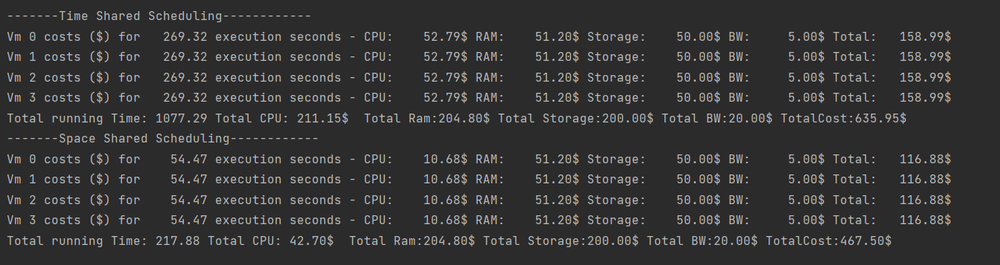
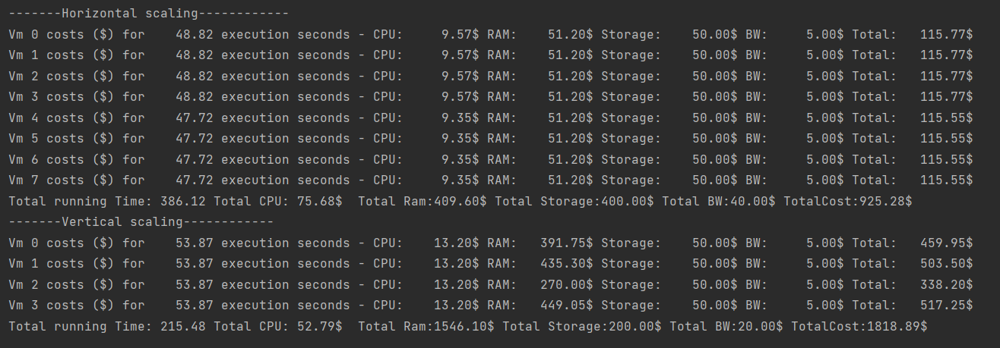
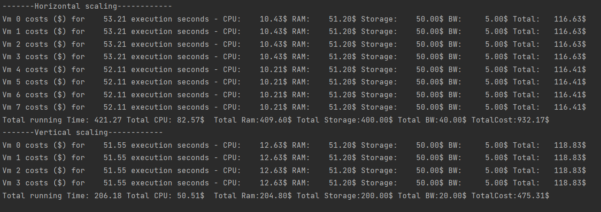
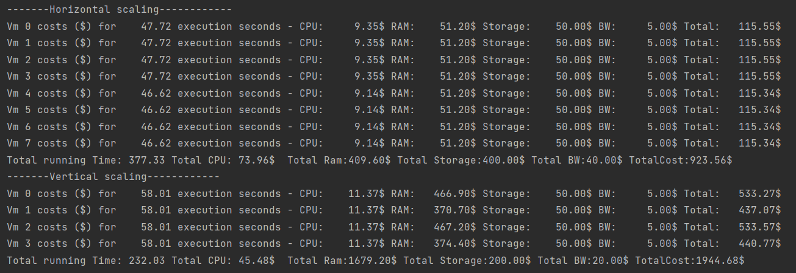
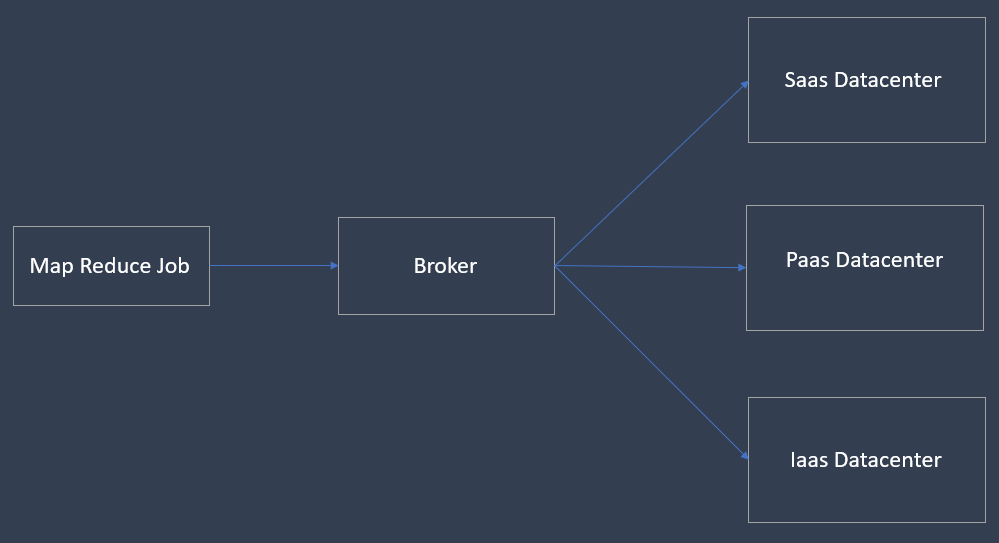

## Simulations

### 1. Simulation of TimeShared and SpaceShared 

This simulation can be run from the class ``Simulations.SimulationTimeVSpace``. The config file used for this simulation is ```SimTimeVSpace.conf```

#### Scheduling policies compared: 
1. <b>VMSchedulerSpaceShared</b> :- This scheduler allocates one or more PEs from a Host to the VMM, and doesn't allow sharing of PEs. The allocated PEs will be used until the VM finishes running. If
there is no enough free PEs as required by a VM, or whether the available PEs doesn't have enough capacity, the allocation fails.
2. <b>VmSchedulerTimeShared</b> :- this scheduler is also called Hypervisor,
that defines a policy to allocate one or more PEs from a PM to a VM, and allows sharing of PEs
by multiple VMs.
3. <b>CloudletSchedulerSpaceShared</b> :- This scheduler allocated each cloudlet to a single vm and does not allow sharing of vm resources with multiple cloudlets. Cloudlets that need scheduling will be part of a waiting list.
4. <b>CloudletSchedulteTimeshared</b> :- Cloudlets execute in time-shared manner in VM.the total processing capacity of the processor cores (in
MIPS) is equally divided by the applications that are using them.

Simulations were run applying multiple combinations of the above schedulers to the configuration file  and the results were collected.

#### Results: 

The output of the simulation when using Time shared scheduling for both cloudlet and vm, and using SpaceShared shared scheduling for cloudlet and vm are shown below.



Output summary from other combinations:

|  Running Time           | VMTimeShared(s)  | VMSpaceShared(s)  |
| -------------           |:-------------:   |     :-----:       |
| CloudletTimeShared(s)   |     259          |     253           |
| CloudletSpaceShared(s)  |     53           |     50            |

|  Costs Incurred         | VMTimeShared($)  | VMSpaceShared($)  |
| -------------           |:-------------:   |     :-----:       |
| CloudletTimeShared ($)  |     628.68       |     466.99        |
| CloudletSpaceShared ($) |     624.23       |     465.19        |

#### Conclusions:

The following conclusions can be drawn from the above simulations:-

- In all combinations, using TimeSharedScheduler's take the most amount of time and also incurs the most execution costs.
- This is expected since in Time Shared scheduling, cloudlets can only run on a vm for a specified amount of time. So in a case where there a large number of cloudlets as is the case in our simulations, the cloudlets are pre-empted (The Cloudsim plus library penalizes cloudlets running on the same vm when timeshared scheduling is set) even before they can complete their execution.
- Therefore in Time shared scheduling, cloudlets end up taking more time to complete execution even when the vms in which they are running, have sufficient resources for the cloudlets complete their execution. Therefore, time shared schedulers drastically degrade performance of large scale simulations.
- When we look at the costs incurred from the simulations, we again see that Time Shared schedulers lead to higher costs as compared to space shared schedulers. This can be directly attributed to the increased run times when using time shared schedulers.
- Finally these simulations provide valuable insights to cloud providers in determining the correct schedulers as well as pricing schemes for services offered.


### 2. Simulation of Horizontal and Vertical scaling

This simulation can be run from the class ``Simulations.HorizontalVsVerticalScaling``. The config file used for this simulation is ```VerticalVHorizontalScale.conf```

#### Scaling methods compared:
1. <b>Horizontal VM Scaling</b> :- In this type od scheduling, a vm overload threshold is specified. When a certain vm's resource utilization goes beyond this threshold, a new vm will be dynamically created and added to an available host.
2. <b>Vertical CPU Scaling</b> :- In this type of scaling, if the cpu utilization of a vm goes above a predefined threshold, new PEs will be dynamicaaly allocated to the VM to allow more processing capacity.
3. <b>Vertical Ram Scaling</b>:- This is similar to verticalCpuScaling but for VMram.

The same Map Reduce job is passed to multiple simulations with different combinations of the above scaling methods and the results are collected. 

#### Results:

Simulation output with horizontal scaling Vs CPU and RAM vertical scaling enabled:



Simulation output with horizontal scaling Vs only CPU vertical scaling enabled:



Simulation output with horizontal scaling Vs only RAM vertical scaling enabled:



#### Conclusions:

1. In all the simulations we can see that in case of Horizontal Scaling, even thought the initial number of VMs is set to 4, the final result has 8 VMs. This is because everytime the utilization threshold of all vms goes beyond the predefined value, a new VM was dynamically allotted to a host for further cloudlet handling. This further leads to additional runtime costs.
2. When both CPU and RAM vertical scaling is enabled, we incur significantly large costs for the increased amount of RAM as well as CPUs.
3. The Additional costs when RAM vertical scaling is enabled is the highest in all the scenarios without any significant improvement in the overall run time. In fact, it can be observed that disabling RAM vertical scaling and having only CPU vertical scaling, provides a slightly better runtime improvement for a small increase in costs.
4. In conclusion, we can see that RAM vertical scaling may not provide the most optimal runtimes and costs, since cloudlets still depend on other factors such as mipscapacity, bandwidth so on for their execution.

### 3. Simulation of SAAS, PAAS and IAAS cloud infrastructure models

This simulation can be run from the class ``Simulations.MixedSimulation``. This simulation uses several config files ```saas.conf``` ```paas.conf``` ```iaas.conf``` that represent the default offerings and pricing criteria of the 3 types of cloud providers.

The config file ```cloudCustomer.conf``` is used to simulate the input parameters that an external customer can provide/choose for each of the cloud providors.

#### Cloud implementation models:
1. <b>SAAS</b> :- In Software as a Service, the cloud provider hosts applications and makes them available to their users over the internet. The end users have little to no control over the internal policies and data storage structure used by the cloud provider.
Thus, in this simulation, we assume an external customer would not have any control over any of the input parameters for SAAS and the default config will be used for SAAS datacenter simulation.

2. <b>PAAS</b> :- In Platform as a Service, the cloud provider takes care of most of the servers, hosts and internal structure of the cloud infrastructure. The User however still has the option to choose internal parametes such as the Operating system to be used, programming language, database etc. In this simulation the ```cloudCustomer.conf``` file takes in such parameters for a pass customer. 
3. <b>IAAS</b> :- In Infrastructure as a Service, The cloud provider offers the essential compute, storage and networking services in a pay as you go basis, that can be purchased and configured to will by any enterprise or individual customer. In such a model several parameters such a scaling behavior, bandwidths, memory etc can be configured. Here again the ```cloudCustomer.conf```  file is used to accept input parameters.

In this simulation we create 3 seperate datacenters each of which represent a differnet cloud privider providing different services. We construct a network topology between the datacenters and the broker by adding a line between each of them.

Dedicated MapReduce Jobs are created for individual datacenters and passed to the broker which then send the jobs to the respective datacenter as shown below:




#### Results:

The Simulation is started and the total cost of running cloudlets in each of the models is generated. Here we calculate the price for each cloudlet that runs on a datacenter based on the pricing model set for that particular datacenter.

The output from running the simulation is as shown below

[ Show Simulation output image here ]

#### Conclusions:

1. When we observe the final costs for each of the models, we see that the SAAS datacenter costs the lowest, followed by PAAS and IAAS. This is due to the difference in pricing schemes setup for each of these models.
2. In case of saas since, the customer pays only for minimal subscriptions or usage charges for any service that is provided over the internet, the costs incurred in this model would be less.
3. In case of Iaas there is greater flexibility in which leads to multiple avenues in which more costs can be incurred.
4. paas comparatively cost in between saas and iaas since most of the infrastructure costs are already fixed by the provider and the minimal changes that a paas model allows does not lead to significant increase in prices.


